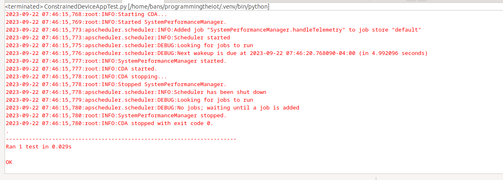

# Constrained Device Application (Connected Devices)

## Lab Module 02

Be sure to implement all the PIOT-CDA-* issues (requirements) listed at [PIOT-INF-02-001 - Lab Module 02](https://github.com/orgs/programming-the-iot/projects/1#column-9974938).

### Description

NOTE: Include two full paragraphs describing your implementation approach by answering the questions listed below.

What does your implementation do? 

Our implementation updates the system performance manager, creates instances of the constrained device app, and constructs multiple system tasks and then integrates them into the system performance manager. Finally runs unit and integration tests on all of the components.

How does your implementation work?

The implementation works by creating a timed instance for the constrained device app. It then proceeds to run the system performance manager which is connected to the three different system monitoring tasks. The base system util task just grabs basic information like name, typeid and telemetry. The system CPU util task which aggregates all the cores into a single CPU utilization percentage to figure out how much of the CPUs are being used. The system memory util task returns the percent utilization of memory that the system uses. Finally the unit and integration tests confirm if the various components of the system are working as intended.

### Code Repository and Branch

NOTE: Be sure to include the branch (e.g. https://github.com/programming-the-iot/python-components/tree/alpha001).

URL: [Github link for CDA](https://github.com/BanSuth/piot-python-components/tree/labmodule02)

### UML Design Diagram(s)

NOTE: Include one or more UML designs representing your solution. It's expected each
diagram you provide will look similar to, but not the same as, its counterpart in the
book [Programming the IoT](https://learning.oreilly.com/library/view/programming-the-internet/9781492081401/).

### Unit Tests Executed

NOTE: TA's will execute your unit tests. You only need to list each test case below
(e.g. ConfigUtilTest, DataUtilTest, etc). Be sure to include all previous tests, too,
since you need to ensure you haven't introduced regressions.

- ConfigUtilTest.py

Screenshot:

- SystemCpuUtilTaskTest.py

Screenshot:

- SystemMemUtilTaskTest.py

Screenshot:

### Integration Tests Executed

NOTE: TA's will execute most of your integration tests using their own environment, with
some exceptions (such as your cloud connectivity tests). In such cases, they'll review
your code to ensure it's correct. As for the tests you execute, you only need to list each
test case below (e.g. SensorSimAdapterManagerTest, DeviceDataManagerTest, etc.)

- ConstrainedDeviceAppTest.py

Screenshot:

- SystemPerformanceManagerTest.py

Screenshot:

EOF.
