# Constrained Device Application (Connected Devices)

## Lab Module 03

Be sure to implement all the PIOT-CDA-* issues (requirements) listed at [PIOT-INF-03-001 - Lab Module 03](https://github.com/orgs/programming-the-iot/projects/1#column-10488379).

### Description

NOTE: Include two full paragraphs describing your implementation approach by answering the questions listed below.

What does your implementation do? 
Our implementation creates a device data manager that manages the various devices under it including the system performance manager, sensor adaptor manager, and actuator adaptor manager. The implementation then has those devices gather data from the tasks set up under each manager and then encompasses the managers and device data manager with data wrappers.

How does your implementation work?

The implementation works by creating data containers so that we can support the data collection and actuation side of our program. Afterward, we build sensor simulation instances to store the data and interfaces to access them. We then implemented our data with actuators tasks which allows us to process the data into log messages. We proceeded to connect the simulated sensors to the sensor adapter manager and the actuators to the actuator adaptor manager, this allowed us a centralized was to utilize and examine the tasks. Furthermore, we created and device data manager to manage all the older and newly created managers and it became our new handler class. This allows the device data manager to process all the sensor data and handle actuation events after it is connected to the constrained device manager.

### Code Repository and Branch

NOTE: Be sure to include the branch (e.g. https://github.com/programming-the-iot/python-components/tree/alpha001).

URL: [Github link for CDA](https://github.com/BanSuth/piot-python-components/tree/labmodule03)

### UML Design Diagram(s)

NOTE: Include one or more UML designs representing your solution. It's expected each
diagram you provide will look similar to, but not the same as, its counterpart in the
book [Programming the IoT](https://learning.oreilly.com/library/view/programming-the-internet/9781492081401/).

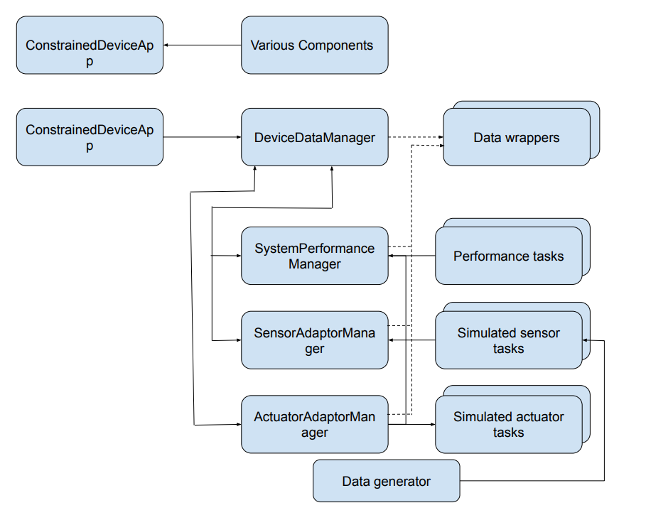

### Unit Tests Executed

NOTE: TA's will execute your unit tests. You only need to list each test case below
(e.g. ConfigUtilTest, DataUtilTest, etc). Be sure to include all previous tests, too,
since you need to ensure you haven't introduced regressions.

- ActuatorDataTest.py 

Screenshot:

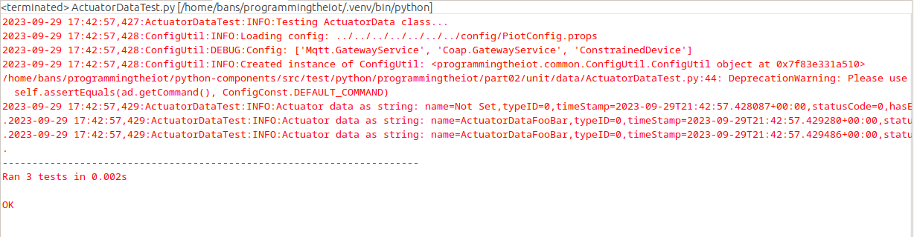

- ConfigUtilTest.py 

Screenshot:

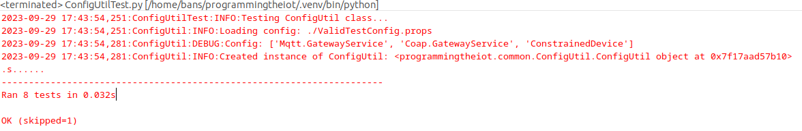

- SensorDataTest.py  

Screenshot:

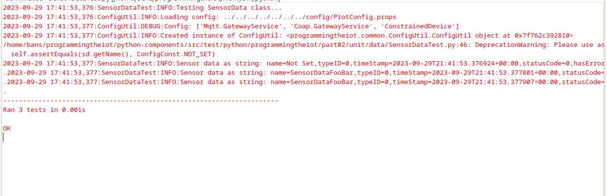

- SystemPerformanceDataTest.py  

Screenshot:

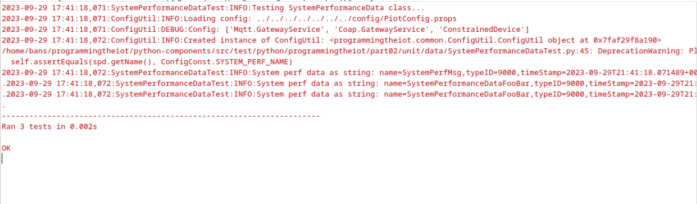
  
- HumiditySensorSimTaskTest.py  

Screenshot:

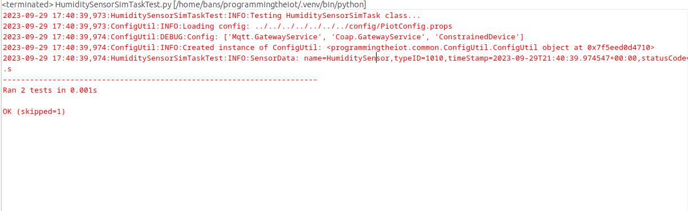
  
- PressureSensorSimTaskTest.py   

Screenshot:

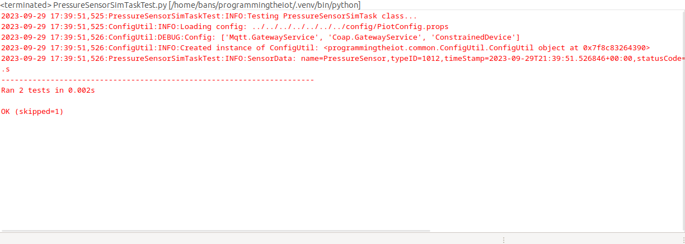
  
- TemperatureSensorSimTaskTest.py   

Screenshot:

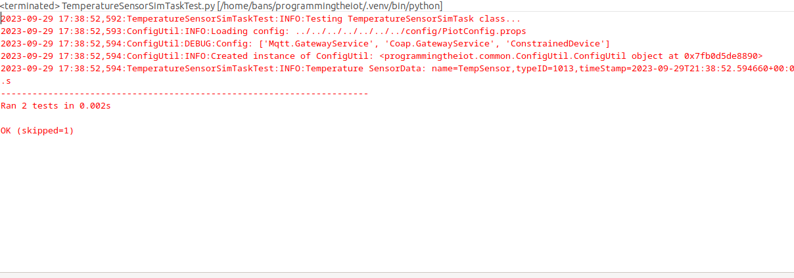
  
- HumidifierActuatorSimTaskTest.py    

Screenshot:

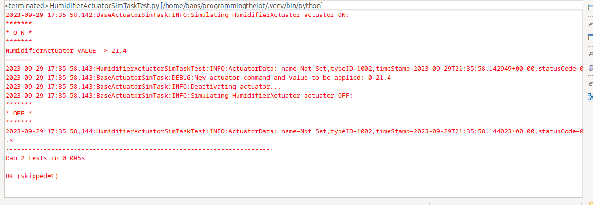
  
- HvacActuatorSimTaskTest.py    

Screenshot:

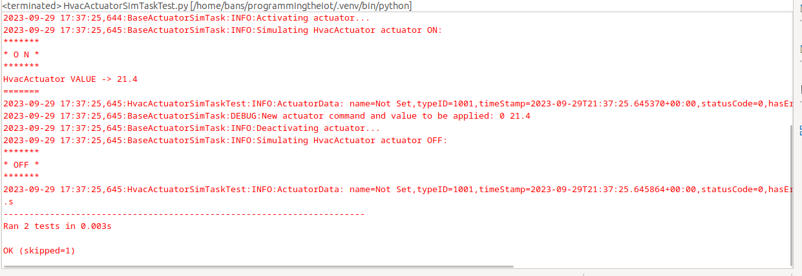
   

### Integration Tests Executed

NOTE: TA's will execute most of your integration tests using their own environment, with
some exceptions (such as your cloud connectivity tests). In such cases, they'll review
your code to ensure it's correct. As for the tests you execute, you only need to list each
test case below (e.g. SensorSimAdapterManagerTest, DeviceDataManagerTest, etc.)

- SensorAdapterManagerTest.py     

Screenshot:

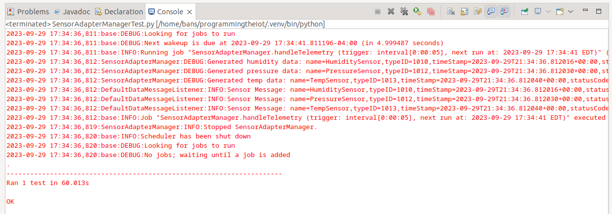

- ActuatorAdapterManagerTest.py      

Screenshot:

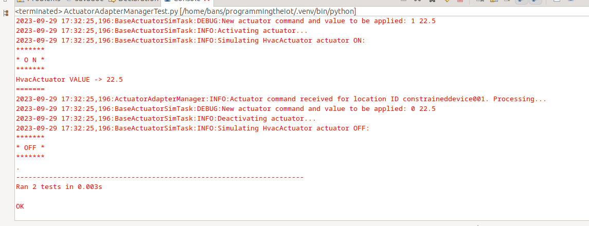

- DeviceDataManagerNoCommsTest.py      

Screenshot:

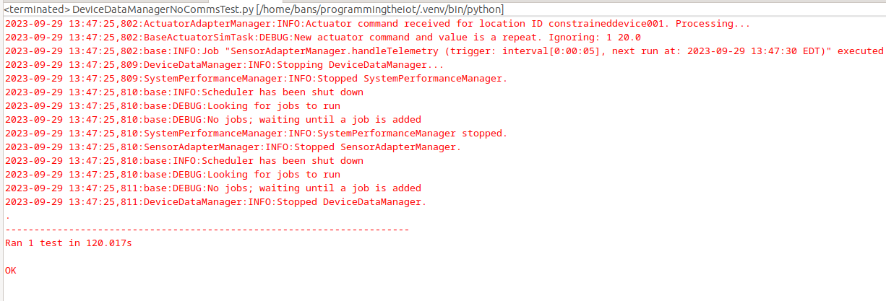

- ConstrainedDeviceAppTest.py     

Screenshot:

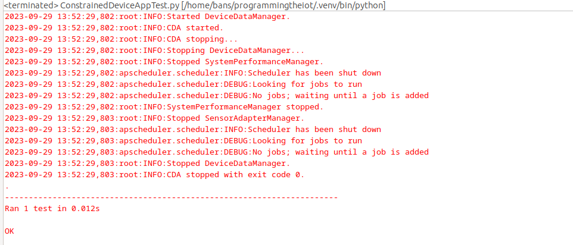

EOF.
