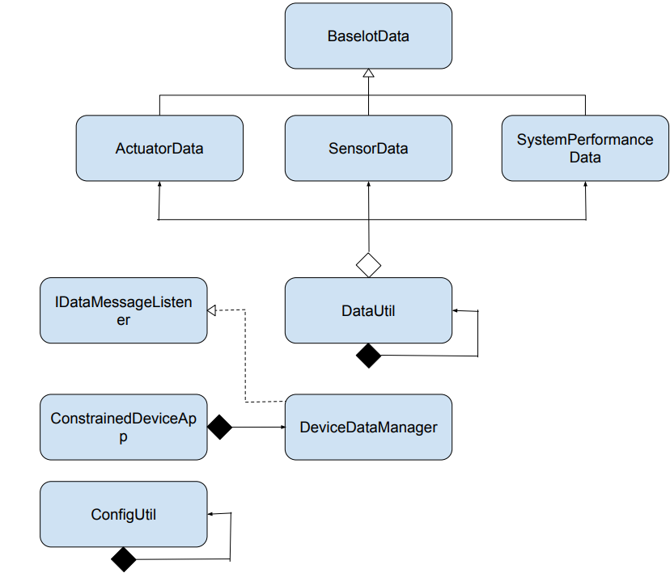
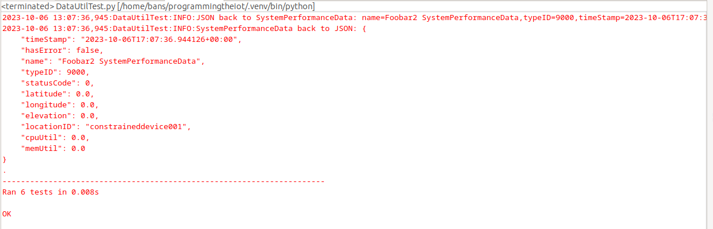
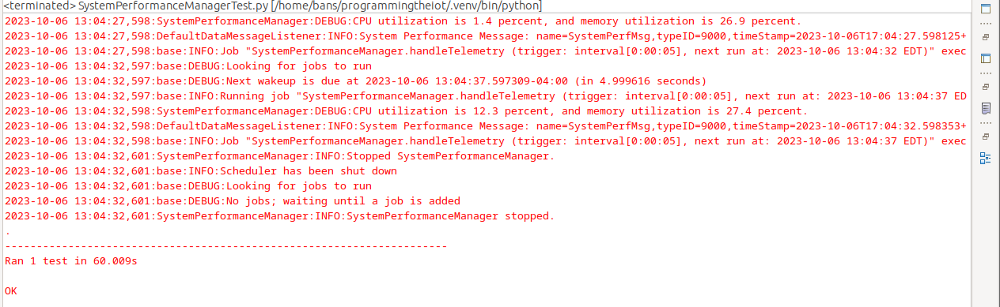
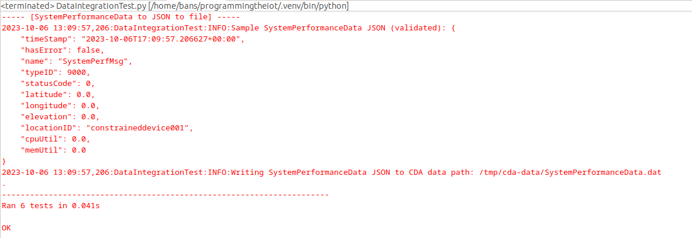

# Constrained Device Application (Connected Devices)

## Lab Module 05

Be sure to implement all the PIOT-CDA-* issues (requirements) listed at [PIOT-INF-05-001 - Lab Module 05](https://github.com/orgs/programming-the-iot/projects/1#column-10488421).

### Description

NOTE: Include two full paragraphs describing your implementation approach by answering the questions listed below.

What does your implementation do? 

Our implementation addes a DataUtil class and updates our device data manager to connect to it. We also modify the SystemPerformanceData function and add JSON conversion functionalities for our ActuatorData,SensorData, and SystemPerformanceData instances, these will all be under our new DataUtil class.

How does your implementation work?

In our implementation our Data util class has new functions called ActuatorDataToJson, SensorDataToJson, SystemPerformanceDataToJson and _generateJsonData to extract data from the BaseIoTData subclasses created in lab activity 3. These function make up the whole of the Datautil class which is connected to Device update manager to collect and organize the data. 
### Code Repository and Branch

NOTE: Be sure to include the branch (e.g. https://github.com/programming-the-iot/python-components/tree/alpha001).

URL: [Github link for CDA](https://github.com/BanSuth/piot-python-components/tree/labmodule05)

### UML Design Diagram(s)

NOTE: Include one or more UML designs representing your solution. It's expected each
diagram you provide will look similar to, but not the same as, its counterpart in the
book [Programming the IoT](https://learning.oreilly.com/library/view/programming-the-internet/9781492081401/).

### Unit Tests Executed

NOTE: TA's will execute your unit tests. You only need to list each test case below
(e.g. ConfigUtilTest, DataUtilTest, etc). Be sure to include all previous tests, too,
since you need to ensure you haven't introduced regressions.

- DataUtilTest.py 

Screenshot: 

### Integration Tests Executed

NOTE: TA's will execute most of your integration tests using their own environment, with
some exceptions (such as your cloud connectivity tests). In such cases, they'll review
your code to ensure it's correct. As for the tests you execute, you only need to list each
test case below (e.g. SensorSimAdapterManagerTest, DeviceDataManagerTest, etc.)

- SystemPerformanceManagerTest.py

Screenshot: 

- DataIntegrationTest.py

Screenshot: 

EOF.
