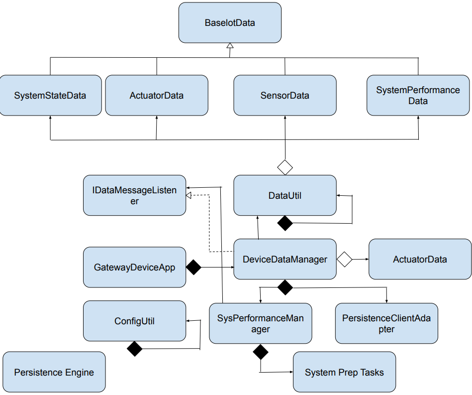
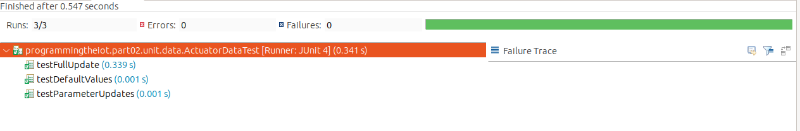
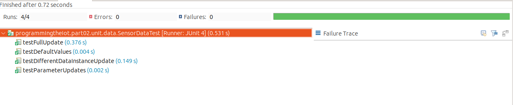
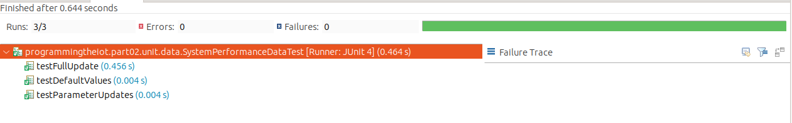
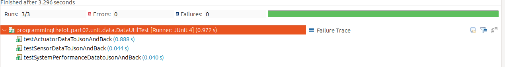
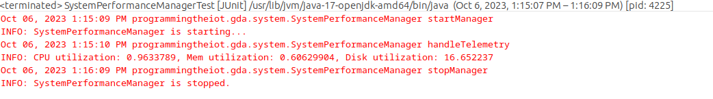
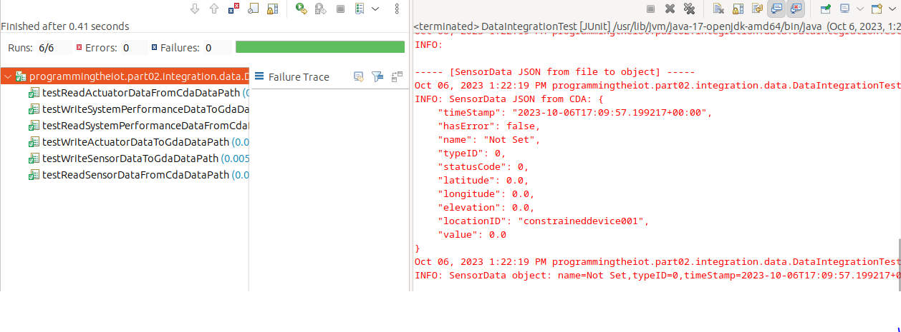
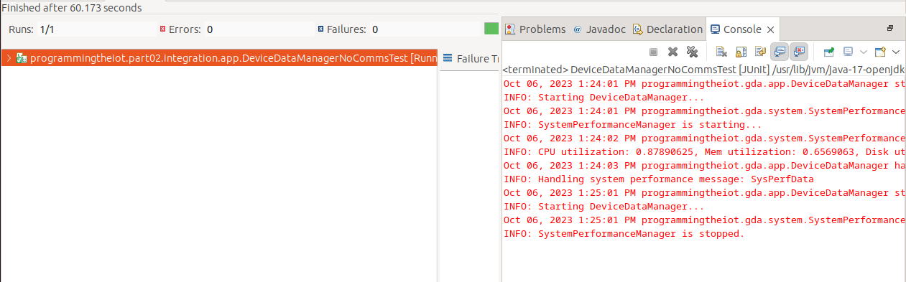
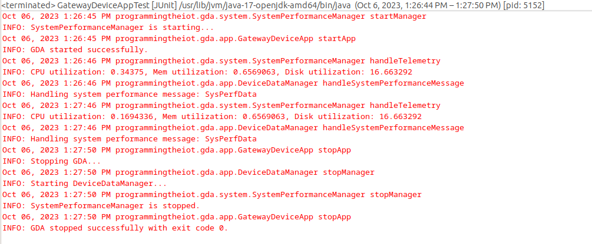

# Gateway Device Application (Connected Devices)

## Lab Module 05

Be sure to implement all the PIOT-GDA-* issues (requirements) listed at [PIOT-INF-05-001 - Lab Module 05](https://github.com/orgs/programming-the-iot/projects/1#column-10488421).

### Description

NOTE: Include two full paragraphs describing your implementation approach by answering the questions listed below.

What does your implementation do? 

Our implementation adds new classes,functions and instances like IDataMessageListener, PersistenceClientAdapater and DataUtil. The focus of all the new additions is to use the data containers created in lab activity 3; Acutator Data, SensorData and SystemPerformanceManager to handle the data and send/receive it from the CDA.

How does your implementation work?

The implementation works by creating the data containers for the GDA specific implementaion and having them derive from the BaseIotData class. Then have the SystemPerformanceManager updated to be able to handle these new additions and add new functionalities like handle Telemetry. We then add JSON translation and connect it with our DataUtil implementaion for GDA, following which we modify the DeviceDataManger class to implement IDataMessageListener and allow it to recieve and invoke messages. Finally a local data persistence adapter will be implemented to allow the GDA to temporarily store state information to make decisions from in the future.

### Code Repository and Branch

NOTE: Be sure to include the branch (e.g. https://github.com/programming-the-iot/python-components/tree/alpha001).

URL: [Github link for GDA](https://github.com/BanSuth/piot-java-components/tree/labmodule05)

### UML Design Diagram(s)

NOTE: Include one or more UML designs representing your solution. It's expected each
diagram you provide will look similar to, but not the same as, its counterpart in the
book [Programming the IoT](https://learning.oreilly.com/library/view/programming-the-internet/9781492081401/).

### Unit Tests Executed

NOTE: TA's will execute your unit tests. You only need to list each test case below
(e.g. ConfigUtilTest, DataUtilTest, etc). Be sure to include all previous tests, too,
since you need to ensure you haven't introduced regressions.

- ActuatorDataTest.java 

Screenshot: 

 

- SensorDataTest.java 

Screenshot: 

 

- SystemPerformanceDataTest.java 

Screenshot: 

 

- DataUtilTest.java 

Screenshot: 

 

### Integration Tests Executed

NOTE: TA's will execute most of your integration tests using their own environment, with
some exceptions (such as your cloud connectivity tests). In such cases, they'll review
your code to ensure it's correct. As for the tests you execute, you only need to list each
test case below (e.g. SensorSimAdapterManagerTest, DeviceDataManagerTest, etc.)

- SystemPerformanceManagerTest.java 

Screenshot: 

 

- DataIntegrationTest.java 

Screenshot: 

 

- DeviceDataManagerNoCommsTest.java 

Screenshot: 

 

- GatewayDeviceAppTest.java 

Screenshot: 

 

EOF.
