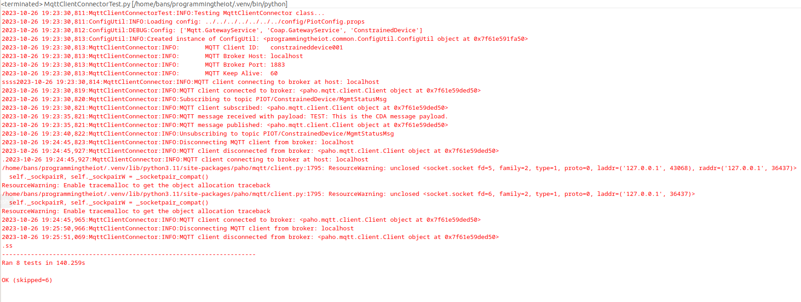
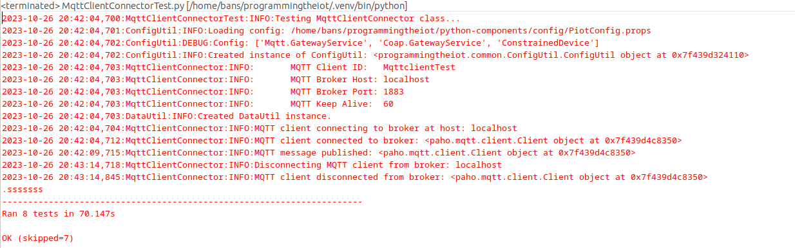
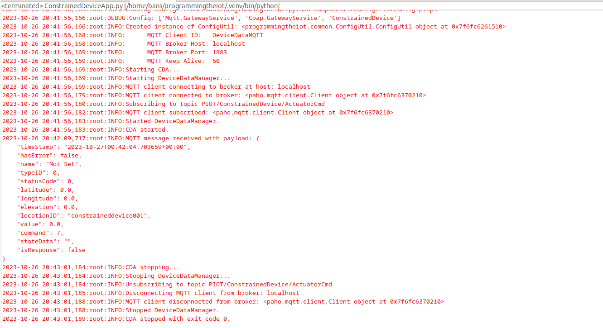

# Constrained Device Application (Connected Devices)

## Lab Module 06

Be sure to implement all the PIOT-CDA-* issues (requirements) listed at [PIOT-INF-06-001 - Lab Module 06](https://github.com/orgs/programming-the-iot/projects/1#column-10488434).

### Description

NOTE: Include two full paragraphs describing your implementation approach by answering the questions listed below.

What does your implementation do? 

Our implementation creates a mqtt connector abstraction, initializes the mqtt client properties and tests the connection. We also deals with callbacks using the paho-mqtt library and uses them to support MQTT events. We also have a publish, subscribe and unsubscribe functionality.

How does your implementation work?

Our implementation works by first creating a MQTTclientconnector and retrieving important values like host,port and keep alive values from the config file. We then create a connect method and test if control packets are generated. We then deal with callback functions and implement connect,disconnect,message,publish and subscribe callsbacks. We then modify these callbacks to support mqtt events by adding parameters such as userdata and flags. Finally we establish a publish, subscribe and unsubscribe functionality using paho documentation. We then finally connect the newly created MQTT connector to our CDA.

### Code Repository and Branch

NOTE: Be sure to include the branch (e.g. https://github.com/programming-the-iot/python-components/tree/alpha001).

URL: [Github link for CDA](https://github.com/BanSuth/piot-python-components/tree/labmodule06)

### UML Design Diagram(s)

NOTE: Include one or more UML designs representing your solution. It's expected each
diagram you provide will look similar to, but not the same as, its counterpart in the
book [Programming the IoT](https://learning.oreilly.com/library/view/programming-the-internet/9781492081401/).

### Unit Tests Executed

NOTE: TA's will execute your unit tests. You only need to list each test case below
(e.g. ConfigUtilTest, DataUtilTest, etc). Be sure to include all previous tests, too,
since you need to ensure you haven't introduced regressions.

None for this module

### Integration Tests Executed

NOTE: TA's will execute most of your integration tests using their own environment, with
some exceptions (such as your cloud connectivity tests). In such cases, they'll review
your code to ensure it's correct. As for the tests you execute, you only need to list each
test case below (e.g. SensorSimAdapterManagerTest, DeviceDataManagerTest, etc.)

- MqttClientConnectorTest (PIOT-CDA-06-003)  
This is running the testConnectAndDisconnect() and testConnectAndCDAManagementStatusPubSub()  
Screenshot:

  
- MqttClientConnectorTest (PIOT-CDA-06-004)  
This running the the testActuatorCmdPubSub() test. Included is the output of the test and ConstrainedDeviceApp.py
MqttClientConnectorTest Screenshot:  
  
ConstrainedDeviceApp.py output Screenshot:

 

EOF.
