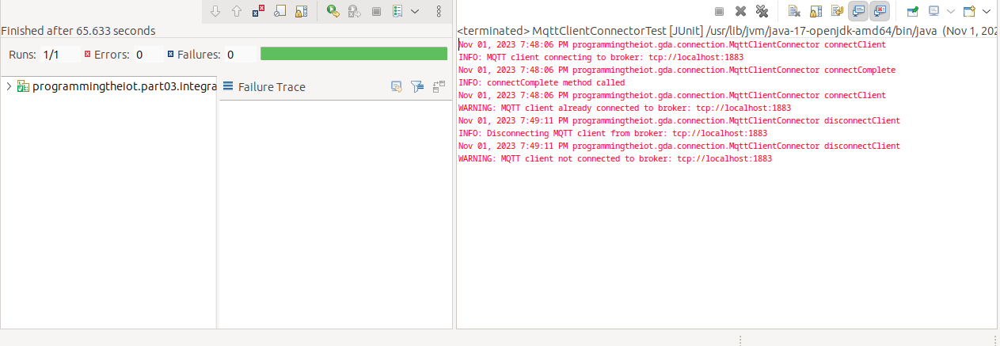
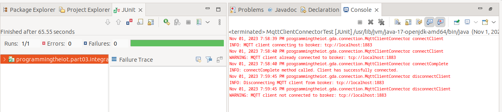
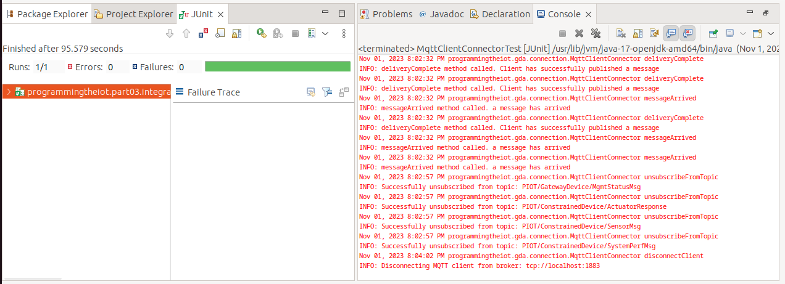
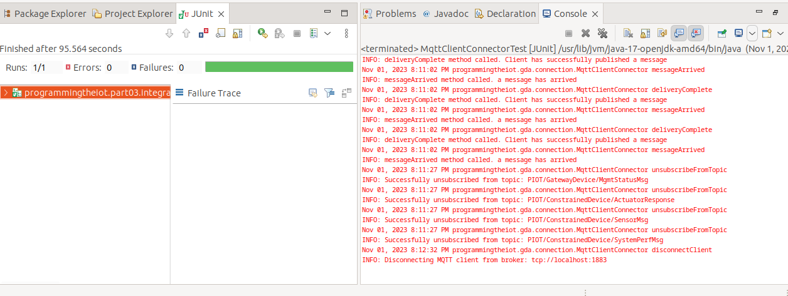
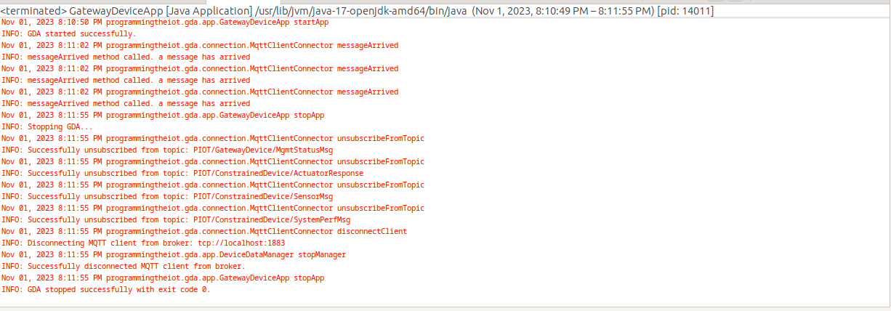

# Gateway Device Application (Connected Devices)

## Lab Module 07

Be sure to implement all the PIOT-GDA-* issues (requirements) listed at [PIOT-INF-07-001 - Lab Module 07](https://github.com/orgs/programming-the-iot/projects/1#column-10488499).

### Description

NOTE: Include two full paragraphs describing your implementation approach by answering the questions listed below.

What does your implementation do? 

Our implementation creates a MQTT connector abstraction, initializes the MQTT client properties, and tests the connection. We also deal with callbacks using the paho-mqtt java library and uses them to support MQTT events. We also have a publish, subscribe, and unsubscribe functionality.

How does your implementation work?

Our implementation works by first creating an MQTTclientconnector and retrieving important values like host, port, and keep alive values from the configutil file. We then create a connect method and test if control packets are generated. We then deal with callback functions for message arrived, connection complete, and delivery complete functions. We also implement publish and subscribe callbacks. We then modify these callbacks to support MQTT events by adding parameters such as user data and flags. Finally, we establish a publish, subscribe, and unsubscribe functionality using paho documentation. We then finally connect the newly created MQTT connector to our GDA.

### Code Repository and Branch

NOTE: Be sure to include the branch (e.g. https://github.com/programming-the-iot/python-components/tree/alpha001).

URL: [Github link for GDA](https://github.com/BanSuth/piot-java-components/tree/labmodule07)

### UML Design Diagram(s)

NOTE: Include one or more UML designs representing your solution. It's expected each
diagram you provide will look similar to, but not the same as, its counterpart in the
book [Programming the IoT](https://learning.oreilly.com/library/view/programming-the-internet/9781492081401/).

### Unit Tests Executed

NOTE: TA's will execute your unit tests. You only need to list each test case below
(e.g. ConfigUtilTest, DataUtilTest, etc). Be sure to include all previous tests, too,
since you need to ensure you haven't introduced regressions.

None for this module

### Integration Tests Executed

NOTE: TA's will execute most of your integration tests using their own environment, with
some exceptions (such as your cloud connectivity tests). In such cases, they'll review
your code to ensure it's correct. As for the tests you execute, you only need to list each
test case below (e.g. SensorSimAdapterManagerTest, DeviceDataManagerTest, etc.)

- MqttClientConnectorTest (PIOT-GDA-07-001)  
This is running the testConnectAndDisconnect() test.  
Screenshot:  

- MqttClientConnectorTest (PIOT-GDA-07-002)  
This is running the testConnectAndDisconnect() test.  
Screenshot:  

- MqttClientConnectorTest (PIOT-GDA-07-003)  
This is running the testPublishAndSubscribe() test.  
Screenshot:  
  

- MqttClientConnectorTest (PIOT-GDA-07-004)   
This is running the testPublishAndSubscribe(). Included is the output of the test and GatewayDeviceApp.java.  
MqttClientConnectorTest  
Screenshot:  
  
GatewayDeviceApp.java output  
Screenshot:  

EOF.
