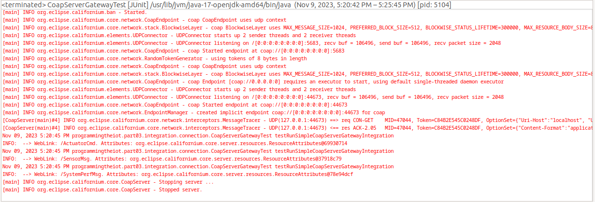

# Gateway Device Application (Connected Devices)

## Lab Module 08

Be sure to implement all the PIOT-GDA-* issues (requirements) listed at [PIOT-INF-08-001 - Lab Module 08](https://github.com/orgs/programming-the-iot/projects/1#column-10488501).

### Description

NOTE: Include two full paragraphs describing your implementation approach by answering the questions listed below.

What does your implementation do? 

Our implemenation also provides CoAP Client Functionality to the GDA, this implementation is very similar to the CDA. This is mainly done through the creation of a CoapClientConnector, a TelemetryObserverHandler, and a SysPerfDataObserverHandler. We then update the DeviceDataManager to accommodate these changes.

How does your implementation work?

Our implementation works by first creating the CoapClientConnector class and implementing initialization knowledge into it. We then implement a GET, PUT, POST, OBSERVE, and DELETE method into the CoapClientConnector Class. Afterward, we test these methods and have them handled by the TelemetryObserverHandler and the SysPerfDataObserverHandler.

### Code Repository and Branch

NOTE: Be sure to include the branch (e.g. https://github.com/programming-the-iot/python-components/tree/alpha001).

URL: [Github link for GDA](https://github.com/BanSuth/piot-java-components/tree/labmodule08)

### UML Design Diagram(s)

NOTE: Include one or more UML designs representing your solution. It's expected each
diagram you provide will look similar to, but not the same as, its counterpart in the
book [Programming the IoT](https://learning.oreilly.com/library/view/programming-the-internet/9781492081401/).

### Unit Tests Executed

NOTE: TA's will execute your unit tests. You only need to list each test case below
(e.g. ConfigUtilTest, DataUtilTest, etc). Be sure to include all previous tests, too,
since you need to ensure you haven't introduced regressions.

None for this module

### Integration Tests Executed

NOTE: TA's will execute most of your integration tests using their own environment, with
some exceptions (such as your cloud connectivity tests). In such cases, they'll review
your code to ensure it's correct. As for the tests you execute, you only need to list each
test case below (e.g. SensorSimAdapterManagerTest, DeviceDataManagerTest, etc.)

- CoapServerGatewayTest.java  
Screenshot:

EOF.
