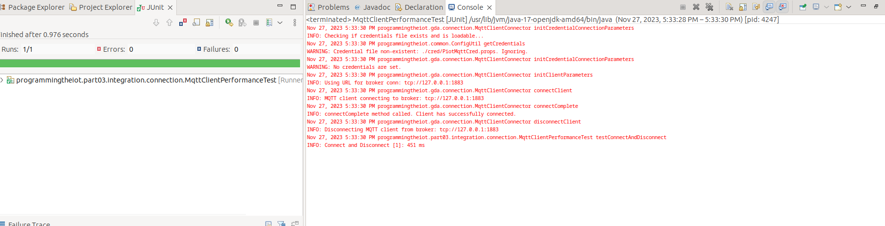
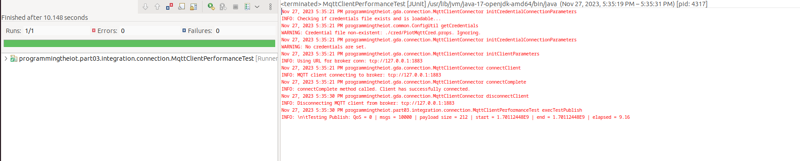
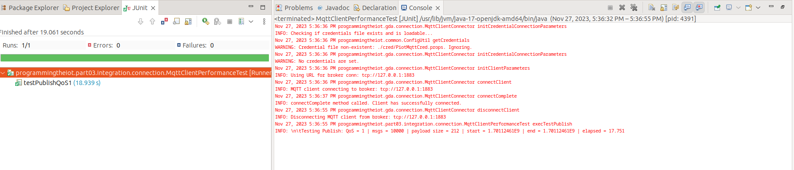
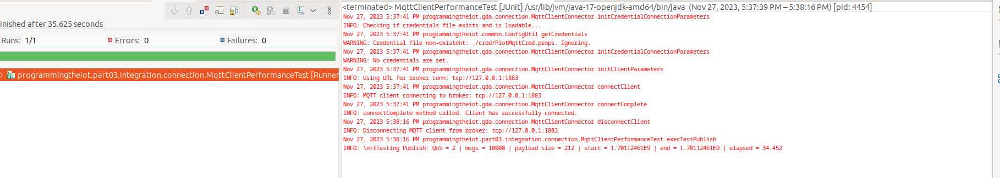
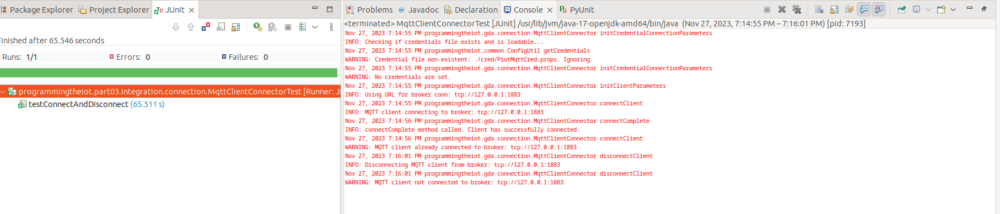
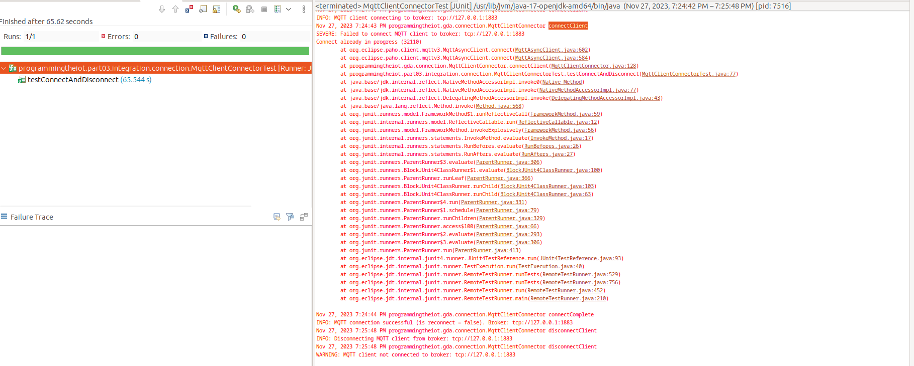
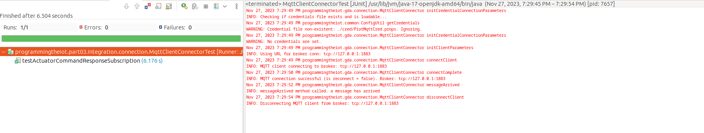
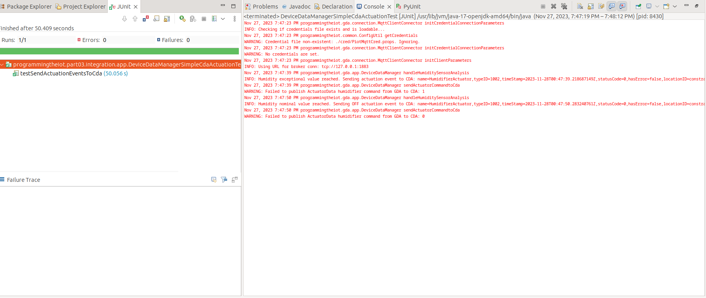
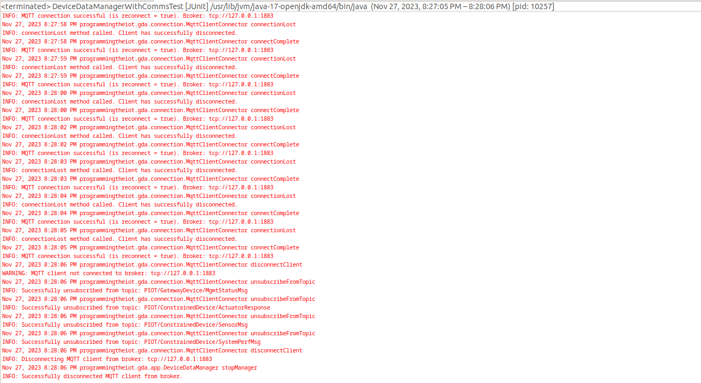
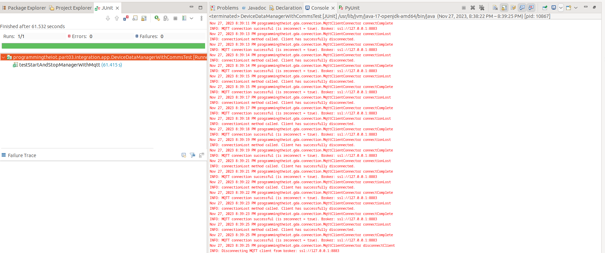

# Gateway Device Application (Connected Devices)

## Lab Module 10

Be sure to implement all the PIOT-GDA-* issues (requirements) listed at [PIOT-INF-10-001 - Lab Module 10](https://github.com/orgs/programming-the-iot/projects/1#column-10488510).

### Description

NOTE: Include two full paragraphs describing your implementation approach by answering the questions listed below.

What does your implementation do? 

Our implementation for the GDA involves adding a simplecertmanagement util package, X.509 certificates as well as multiple tests. This is very important in establishing a security setup with our other classes like the MQTTClientConnector class.

How does your implementation work?

Our implemenation works by having a priviate method to load credentials from a config file and useing the requisite dependencies to run it along side a SSL socket factory initializor method. Finally we will initialize our MQTT client connect with encryption enabled.

### Code Repository and Branch

NOTE: Be sure to include the branch (e.g. https://github.com/programming-the-iot/python-components/tree/alpha001).

URL: [Github link for GDA](https://github.com/BanSuth/piot-java-components/tree/labmodule10)

### UML Design Diagram(s)

NOTE: Include one or more UML designs representing your solution. It's expected each
diagram you provide will look similar to, but not the same as, its counterpart in the
book [Programming the IoT](https://learning.oreilly.com/library/view/programming-the-internet/9781492081401/).

### Unit Tests Executed

NOTE: TA's will execute your unit tests. You only need to list each test case below
(e.g. ConfigUtilTest, DataUtilTest, etc). Be sure to include all previous tests, too,
since you need to ensure you haven't introduced regressions.

None for this module

### Integration Tests Executed

NOTE: TA's will execute most of your integration tests using their own environment, with
some exceptions (such as your cloud connectivity tests). In such cases, they'll review
your code to ensure it's correct. As for the tests you execute, you only need to list each
test case below (e.g. SensorSimAdapterManagerTest, DeviceDataManagerTest, etc.)

## MqttClientPerformanceTest (PIOT-INT-10-001)  
This is running the testConnectAndDisconnect() test.  
Screenshot:  

This is running the testPublishQoS0() test.  
Screenshot:  

This is running the testPublishQoS1() test.  
Screenshot:  

This is running the testPublishQoS2() test.  
Screenshot:  

## MqttClientConnectorTest (PIOT-GDA-10-001)
Screenshot:  

## MqttClientConnectorTest (PIOT-GDA-10-002)
This is running the testConnectAndDisconnect() test.  
Screenshot:  

This is running the testActuatorCommandResponseSubscription() test.  
Screenshot:

## DeviceDataManagerSimpleCdaActuationTest (PIOT-GDA-10-003)
Screenshot:

## PIOT-INT-10-003 (Running CDA and GDA Together)
GDA Output Screenshot:

## PIOT-INT-10-004 (Running CDA and GDA Together with TLS)
GDA Output Screenshot:

EOF.
